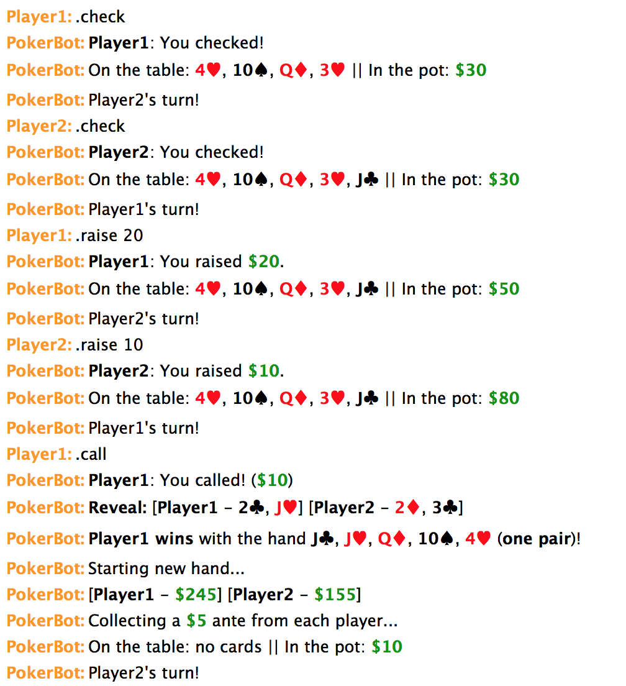

PokerBot -- An IRC Croupier
===========================

PokerBot is a lightweight IRC bot used for playing text-based poker (specifically, Texas hold 'em), built on top of the [PircBot framework](http://www.jibble.org/pircbot.php).
This repository is forked from [Pokerbot](https://github.com/arshajii/pokerbot).



Details
--------

### Starting up

The bot can be launched with the following command from the root directory:

```
./gradlew run
```

The bot will join the channel specified in `parameters.cfg`, but supports multiple channels.

### Commands

Commands are issued by prefixing a command keyword with a predefined command prefix (`.` by default). Available commands are listed below.

#### Creating more tables

Private message the bot with `createtable CHANNELNAME`, and it will join that channel and set up a table. Kicking the
bot removes the table. If the channel requires a password, just supply it like `createtable CHANNELNAME CHANNELPASSWORD`.

#### General Commands

Keyword | Description
--------|------------
`ping` | Ping the bot for a reply.
`join` | Add yourself to the players list for the next game.
`buyin` | Join the next hand for an existing game
`unjoin` | Remove yourself from the players list for the next game.
`joined` | Display who is in the players list for the next game.
`start` | Start the game.
`clear` | Clear the players list for the next game.
`stop` | Stop the game.
`help` | Display help information.

#### Game Commands

Keyword | Description
--------|------------
`call` | Match the current bet.
`check` | Raise nothing, pass on to the next player.
`raise` | Raise by the specified amount *on top of* the last raise (which may have been 0).
`fold` | Discard your hand and forfeit. You can resume playing next hand.
`cashout` | Quit the game, taking the fortunes you've won with you.

### Customization

The bot's parameters (e.g. name, game channel, command prefix, admin key) can be customized through the [`parameters.cfg`](parameters.cfg) configuration file.

Requirements
------------

- PircBot library (SSL-modified jar included)
- Java 8


To-do
-----

- [x] Small and big blinds
- [x] Side pot logic
- [x] Further separation of front-end (bot) and back-end (poker engine)
- [x] Let ongoing games be joinable


Issues
------

PokerBot is still in its early stages of development, so there will likely be various bugs that have been overlooked. If you happen to find one, please [submit an issue](https://github.com/bladh/pokerbot/issues/new) about it.

Feel free to also submit an issue to request a feature that does not exist, or to request an enhancement to an existing feature.


